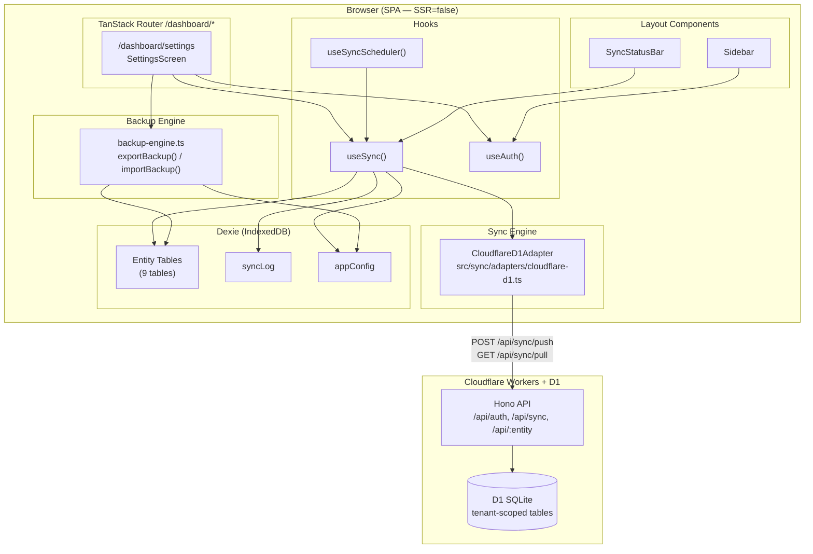
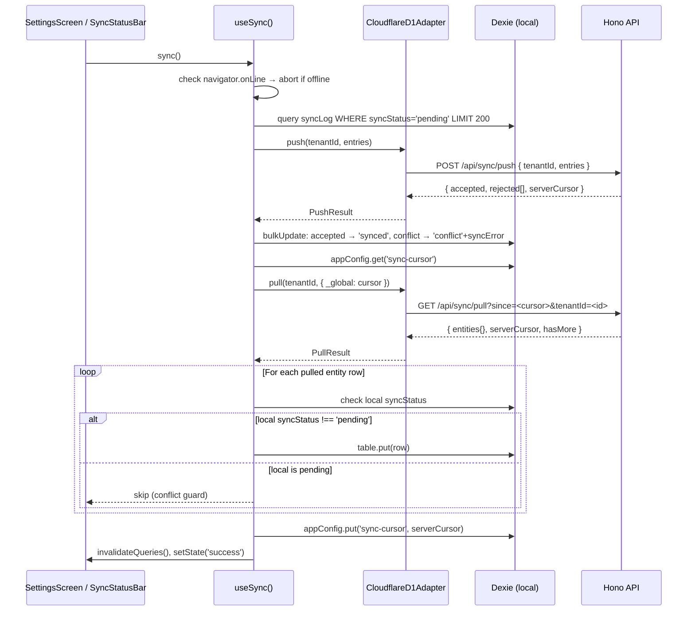
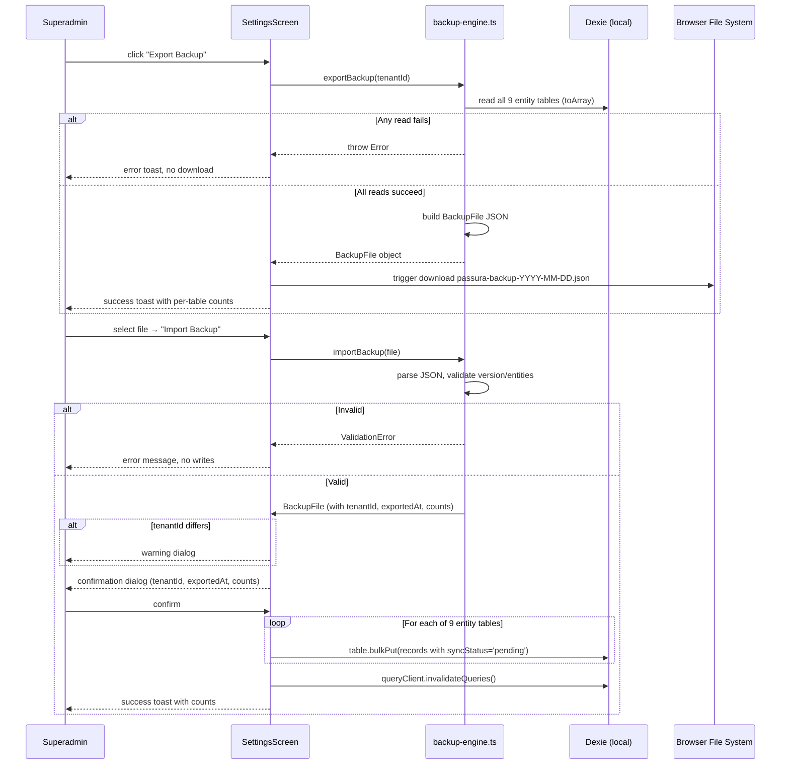

# Design Document — Backup, Sync & Multitenancy

## Overview

This design covers three interconnected capabilities added to **Passura**, a local-first Toraja Rambu Solo' ceremonial-records app:

1. **Backup** — export all local Dexie data as a portable JSON file and restore from it.
2. **Sync** — complete the stub push/pull infrastructure into reliable, conflict-aware bidirectional sync with auto-sync scheduling.
3. **Multitenancy** — tenant-scoped data isolation on the Cloudflare D1 backend and a unified Settings screen.

### Key Design Decisions

| # | Decision | Rationale |
|---|---|---|
| 1 | Single `/dashboard/settings` route with tabs | Sidebar already references `/dashboard/profile`, `/dashboard/backup`, `/dashboard/sync`; consolidating reduces navigation surface and gives conflict resolution a natural home |
| 2 | `tenant_id TEXT NOT NULL` on all D1 entity tables (Drizzle migration) | Server-enforced isolation is the only correct layer; clients cannot be trusted to self-segment |
| 3 | JWT carries `tenantId` claim | Avoids an extra DB lookup per request; login route reads `tenantId` from the elder's D1 row |
| 4 | `useSyncScheduler` hook with `setInterval` at 5-minute cadence | Simple, deterministic, easy to unit-test; starts 5 min after mount or re-enable — never immediately |
| 5 | Standalone `backup-engine.ts` module | Pure functions — easy to property-test without rendering a component |
| 6 | Pull conflict guard: skip `table.put()` if local `syncStatus === "pending"` | Last-write-wins would destroy local unsaved work; pending local changes take priority until explicitly resolved |
| 7 | Dexie v4 version bump for `syncLog` `syncError` field | Non-breaking Dexie migration; adds the index needed for conflict queries |
| 8 | `syncError?: string` on `SyncLogEntry` | Stores per-entry rejection reason for the Conflicts UI without a separate table |


---

## Architecture

### High-Level Component Diagram




### Sync Data Flow




### Backup Data Flow




---

## Components and Interfaces

### New Files to Create

| Path | Purpose |
|------|---------|
| `src/backup/backup-engine.ts` | Pure export/import functions |
| `src/backup/backup-types.ts` | `BackupFile`, `ImportResult`, `ExportResult` type definitions |
| `src/hooks/useSyncScheduler.ts` | 5-minute auto-sync interval hook |
| `src/routes/dashboard/settings.tsx` | TanStack Router file-based route |
| `src/components/screen/settings/SettingsScreen.tsx` | Top-level settings page (tabs) |
| `src/components/screen/settings/TenantTab.tsx` | Tenant ID configuration tab |
| `src/components/screen/settings/SyncTab.tsx` | Auth + manual sync + auto-sync tab |
| `src/components/screen/settings/BackupTab.tsx` | Export + import tab |
| `src/components/screen/settings/ConflictsTab.tsx` | Conflict list + resolution tab |
| `src/components/screen/settings/DangerZoneTab.tsx` | Data reset tab |
| `drizzle/0001_add_tenant_id.sql` | Drizzle migration adding `tenant_id` to all entity tables |

### Files to Modify

| Path | Change |
|------|--------|
| `src/db/types.ts` | Add `syncError?: string` to `SyncLogEntry`; add `tenantId` concept to docs |
| `src/db/local-db.ts` | Bump to version 4 — add `syncError` index on `syncLog` |
| `src/hooks/useSync.ts` | Complete push/pull logic per requirements (batch, per-entry results, 401 handling, tenantId from appConfig, conflict guard) |
| `src/sync/adapters/cloudflare-d1.ts` | Pass `tenantId` in pull URL; handle 401 by deleting token; read API base from `appConfig["api-url"]` with `VITE_API_URL` fallback |
| `src/components/layout/Sidebar.tsx` | Replace the three Konfigurasi nav items with a single "Pengaturan" → `/dashboard/settings` item |
| `src/components/layout/SyncStatusBar.tsx` | Add conflict count display; add "Auto-sync off" indicator |
| `api/src/db/schema.ts` | Add `tenantId` column to all entity tables and `syncLog` |
| `api/src/lib/auth.ts` | Add `tenantId: string` to `JwtPayload` interface |
| `api/src/routes/auth.ts` | Read `tenantId` from elder's D1 row; include in JWT; return 403 if absent |
| `api/src/routes/sync.ts` | Add tenant validation on push (400 if absent) and pull (400 if absent, 403 if mismatched); scope all queries by JWT `tenant_id` |


### Interface Definitions

#### BackupFile (src/backup/backup-types.ts)

```typescript
export interface BackupFile {
  version: 1;
  tenantId: string;
  exportedAt: string;       // ISO-8601 datetime
  entities: {
    clans: Clan[];
    elders: Elder[];
    participants: Participant[];
    groups: Group[];
    animalTypes: AnimalType[];
    loans: Loan[];
    receipts: Receipt[];
    handovers: Handover[];
    obligations: Obligation[];
  };
}

export interface ExportResult {
  backup: BackupFile;
  counts: Record<string, number>; // tableName → record count
}

export type ImportResult =
  | { success: true; counts: Record<string, number> }
  | { success: false; error: string; failedTable?: string };
```

#### Extended SyncLogEntry (src/db/types.ts — modified)

```typescript
export interface SyncLogEntry {
  id?: number;
  entityType: string;
  entityId: string;
  action: "create" | "update" | "delete";
  data: Record<string, unknown>;
  syncStatus: "pending" | "synced" | "failed" | "conflict";
  syncError?: string;   // NEW — stores rejection reason for conflicts
  createdAt: number;
}
```

#### Extended JwtPayload (api/src/lib/auth.ts — modified)

```typescript
export interface JwtPayload {
  elderId: string;
  email: string;
  role: string;
  tenantId: string;   // NEW — tenant scoping claim
  iat: number;
  exp: number;
}
```

#### useSyncScheduler hook

```typescript
// src/hooks/useSyncScheduler.ts
export function useSyncScheduler(sync: () => Promise<void>): void
// Fires sync() every 5 minutes when:
//   - navigator.onLine === true
//   - appConfig["sync-token"] is set and non-expired
//   - appConfig["auto-sync-enabled"] === true
// Interval starts 5 minutes after mount or after auto-sync is re-enabled.
// Clears interval on unmount.
```


---

## Data Models

### Dexie Schema Migration (local-db.ts)

```typescript
// Version 4 — adds syncError field support and index for conflict queries
this.version(4).stores({
  syncLog: "++id, entityType, entityId, action, syncStatus, [syncStatus+createdAt], syncError",
});
// No other table structure changes needed on Dexie side.
// tenant_id is server-side only; local records belong to exactly one tenant
// (the local appConfig["tenant-id"]).
```

### appConfig Key Registry

| Key | Type | Purpose |
|-----|------|---------|
| `session-elder-id` | `string` | Local auth session (existing) |
| `sync-token` | `string` | JWT from `/api/auth/login` |
| `sync-cursor` | `string` | Unix timestamp (seconds) — last successful pull |
| `tenant-id` | `string` | UUID v4 — local tenant identifier |
| `api-url` | `string` | Configured API base URL (overrides `VITE_API_URL`) |
| `auto-sync-enabled` | `boolean` | Whether the 5-min scheduler is active |

### D1 Schema Migration (api)

New Drizzle migration `drizzle/0001_add_tenant_id.sql`:

```sql
-- Add tenant_id to every entity table and sync_log
ALTER TABLE clans         ADD COLUMN tenant_id TEXT NOT NULL DEFAULT '';
ALTER TABLE elders        ADD COLUMN tenant_id TEXT NOT NULL DEFAULT '';
ALTER TABLE participants  ADD COLUMN tenant_id TEXT NOT NULL DEFAULT '';
ALTER TABLE groups        ADD COLUMN tenant_id TEXT NOT NULL DEFAULT '';
ALTER TABLE animal_types  ADD COLUMN tenant_id TEXT NOT NULL DEFAULT '';
ALTER TABLE loans         ADD COLUMN tenant_id TEXT NOT NULL DEFAULT '';
ALTER TABLE receipts      ADD COLUMN tenant_id TEXT NOT NULL DEFAULT '';
ALTER TABLE handovers     ADD COLUMN tenant_id TEXT NOT NULL DEFAULT '';
ALTER TABLE obligations   ADD COLUMN tenant_id TEXT NOT NULL DEFAULT '';
ALTER TABLE sync_log      ADD COLUMN tenant_id TEXT NOT NULL DEFAULT '';

-- Add syncError column to sync_log for conflict tracking
ALTER TABLE sync_log ADD COLUMN sync_error TEXT;

-- Indexes for tenant-scoped queries (D1 supports CREATE INDEX)
CREATE INDEX IF NOT EXISTS idx_clans_tenant        ON clans(tenant_id);
CREATE INDEX IF NOT EXISTS idx_elders_tenant       ON elders(tenant_id);
CREATE INDEX IF NOT EXISTS idx_participants_tenant ON participants(tenant_id);
CREATE INDEX IF NOT EXISTS idx_groups_tenant       ON groups(tenant_id);
CREATE INDEX IF NOT EXISTS idx_animal_types_tenant ON animal_types(tenant_id);
CREATE INDEX IF NOT EXISTS idx_loans_tenant        ON loans(tenant_id);
CREATE INDEX IF NOT EXISTS idx_receipts_tenant     ON receipts(tenant_id);
CREATE INDEX IF NOT EXISTS idx_handovers_tenant    ON handovers(tenant_id);
CREATE INDEX IF NOT EXISTS idx_obligations_tenant  ON obligations(tenant_id);
CREATE INDEX IF NOT EXISTS idx_sync_log_tenant     ON sync_log(tenant_id, updated_at);
```

Drizzle schema additions in `api/src/db/schema.ts`:

```typescript
// Example for clans — same pattern applied to all 9 entity tables + syncLog
export const clans = sqliteTable("clans", {
  // ... existing columns ...
  tenantId: text("tenant_id").notNull().default(""),
});
```


---

## Sync Engine Design

### Push Phase (useSync — revised)

```
1. Check navigator.onLine → abort + toast if offline (R4.7)
2. Check adapter.isAvailable() → abort + toast if no token (R6)
3. Read tenantId from appConfig["tenant-id"] (R4.2)
4. Query syncLog WHERE syncStatus='pending', LIMIT 200 (R4.1)
5. If no pending entries, skip push phase
6. Map entries to SyncEntry[] format
7. Call adapter.push(tenantId, entries)
   - On 401 response: delete appConfig["sync-token"], update state, prompt re-auth (R6.5)
   - On network error / 5xx: leave all entries as 'pending', toast error (R4.6)
8. For each entry in response:
   - accepted → syncLog.update(id, { syncStatus: 'synced' })
   - conflict → syncLog.update(id, { syncStatus: 'conflict', syncError: reason })
   - internal_error → leave as 'pending' (R4.5)
```

### Pull Phase (useSync — revised)

```
1. Read cursor = appConfig["sync-cursor"] ?? "0"
2. Call adapter.pull(tenantId, { _global: cursor })
   - On 401 response: delete token, prompt re-auth (R6.5)
   - On network error / 4xx / 5xx: keep cursor unchanged, toast error, abort (R5.7)
3. For each entity type in pullResult.entities:
   a. Resolve Dexie table name (animal-types → animalTypes)
   b. For each row:
      - Check local record: db[table].get(row.id)
      - If local exists AND local.syncStatus === 'pending': SKIP (R5.3 — conflict guard)
      - Else: table.put({ ...row, syncStatus: 'synced' })
4. If pullResult.hasMore === true:
   - Update cursor to pullResult.cursors["_global"]
   - Recurse with new cursor until hasMore === false (R5.5)
5. Save final cursor to appConfig["sync-cursor"] (R5.4)
6. Invalidate all React Query caches (R5.6)
7. setState('success'), setLastSyncAt(new Date())
```

### Adapter Changes (cloudflare-d1.ts)

```typescript
async pull(tenantId: string, cursors: SyncCursors): Promise<PullResult> {
  const since = cursors["_global"] ?? "0";
  // Read API base from appConfig at call time (supports runtime override)
  const apiBase = await getApiBase(); // reads appConfig["api-url"] ?? VITE_API_URL
  const url = `${apiBase}/api/sync/pull?since=${since}&tenantId=${encodeURIComponent(tenantId)}`;
  const res = await fetch(url, { headers: { Authorization: `Bearer ${this.token}` } });
  if (res.status === 401) throw new AuthError("401");
  if (!res.ok) throw new Error(`Pull failed: ${res.status}`);
  // ... parse response ...
}
```

### Auto-Sync Scheduler (useSyncScheduler.ts)

```typescript
export function useSyncScheduler(sync: () => Promise<void>): void {
  // Reads auto-sync-enabled and sync-token from appConfig reactively
  // Schedules setInterval(sync, 5 * 60 * 1000) when all conditions met
  // First fires 5 minutes after hook mounts or after re-enable
  // NOT immediately on re-enable (R7.8)
  // Clears on unmount via useEffect cleanup
}
```

The scheduler is mounted in the dashboard root layout (`src/routes/dashboard/route.tsx`) so it is active for the entire session.

### API Server: Push Route Changes

```
POST /api/sync/push
- Validate body.tenantId: non-empty string → 400 if absent/empty (R3.1)
- For create/update: set tenant_id = auth.tenantId (JWT claim) on every row (R3.3)
  - Ignore body.tenantId for row write (security: client cannot spoof tenant)
- For delete: WHERE id = ? AND tenant_id = auth.tenantId (R3.4)
- Per-entry response: { id, status: "synced" | "conflict" | "internal_error", reason? }
```

### API Server: Pull Route Changes

```
GET /api/sync/pull?since=<ts>&tenantId=<id>
- Validate tenantId param present → 400 if absent (R3.7)
- Validate tenantId param === auth.tenantId → 403 if differs (R3.5)
- All entity queries: WHERE tenant_id = auth.tenantId AND updated_at > since (R3.6)
- Pagination: LIMIT 500 per table; hasMore = rows.length >= 500 (R5.5)
```

### API Server: Auth Route Changes

```
POST /api/auth/login
- After password verification:
  - Read elder.tenantId from D1
  - IF elder.tenantId is null or empty → return 403 (R3.10)
  - Include tenantId in JWT payload: signJwt({ elderId, email, role, tenantId })
- Response unchanged otherwise (R3.9)
```


---

## Backup Engine Design

### src/backup/backup-engine.ts

```typescript
const ENTITY_TABLES = [
  "clans", "elders", "participants", "groups",
  "animalTypes", "loans", "receipts", "handovers", "obligations"
] as const;

export async function exportBackup(tenantId: string): Promise<ExportResult> {
  // 1. Read all 9 tables from Dexie (all local records belong to local tenant)
  // 2. Build BackupFile object:
  //    { version: 1, tenantId, exportedAt: new Date().toISOString(), entities: {...} }
  // 3. Ensure numeric timestamps are stored as integers (Math.trunc)
  // 4. JSON arrays (witnesses, members, repayments) are already native arrays in Dexie —
  //    JSON.stringify preserves them as arrays
  // 5. Return { backup, counts }
  // Throws on any Dexie read error (caller handles toast + no-download)
}

export async function importBackup(
  file: File,
  localTenantId: string
): Promise<{ backup: BackupFile; tenantMismatch: boolean }> {
  // Validation phase (throws ImportError on failure — no Dexie writes):
  // 1. Check file.size <= 50 * 1024 * 1024 (50 MB)
  // 2. Parse JSON — throw if invalid
  // 3. Check parsed.version === 1 — throw with descriptive message if not
  // 4. Check parsed.entities is a non-null object — throw if missing
  // 5. Return { backup, tenantMismatch: backup.tenantId !== localTenantId }
  // Does NOT write to Dexie — caller shows confirmation dialog first
}

export async function applyImport(backup: BackupFile): Promise<ImportResult> {
  // Write phase (called after user confirms):
  // For each table in ENTITY_TABLES:
  //   const records = backup.entities[table].map(r => ({ ...r, syncStatus: 'pending' }))
  //   await db[table].bulkPut(records)
  //   — on failure: return { success: false, error, failedTable }
  //   — successfully written tables remain intact on partial failure (R10.9)
  // Preserves original id, createdAt, updatedAt (R10.6)
  // syncStatus always set to 'pending' (R10.7)
  // Returns { success: true, counts } on complete success
}
```

### Filename Generation

```typescript
function buildFilename(): string {
  const d = new Date();
  const yyyy = d.getFullYear();
  const mm = String(d.getMonth() + 1).padStart(2, "0");
  const dd = String(d.getDate()).padStart(2, "0");
  return `passura-backup-${yyyy}-${mm}-${dd}.json`;
}
```

### Download Trigger

```typescript
function downloadJson(backup: BackupFile): void {
  const blob = new Blob([JSON.stringify(backup, null, 2)], { type: "application/json" });
  const url = URL.createObjectURL(blob);
  const a = document.createElement("a");
  a.href = url;
  a.download = buildFilename();
  a.click();
  URL.revokeObjectURL(url);
}
```


---

## Settings Screen UI Layout

Route: `/dashboard/settings` — TanStack Router file at `src/routes/dashboard/settings.tsx`.

The page uses shadcn/ui `Tabs` component with five tabs. Superadmin sees all controls; validators/participants see read-only displays with controls hidden or disabled.

```
┌─────────────────────────────────────────────────────────────────┐
│  Settings                                                       │
│  ──────────────────────────────────────────────────────────     │
│  [Tenant] [Sinkronisasi] [Backup] [Konflik] [Zona Bahaya]       │
│                                                                 │
│  ── Tenant Tab ──────────────────────────────────────────────   │
│  Tenant ID (read-only for all, editable for superadmin)         │
│  ┌───────────────────────────────┐  [Simpan]  (superadmin only) │
│  │ abc-123-...                   │                               │
│  └───────────────────────────────┘                               │
│  API Server URL                                                 │
│  ┌───────────────────────────────┐  [Simpan]  (superadmin only) │
│  │ https://...                   │                               │
│  └───────────────────────────────┘                               │
│                                                                 │
│  ── Sinkronisasi Tab ────────────────────────────────────────   │
│  Status: ● Authenticated (exp: 2025-12-31) | ○ Not authenticated│
│                                                                 │
│  Email: [____________]  Password: [____________]  [Autentikasi] │
│                        (superadmin only)                        │
│  [Keluar dari Server]  (superadmin only)                        │
│                                                                 │
│  Auto-sync: [toggle]  (superadmin only)                         │
│  [Sinkronisasi Sekarang]                                        │
│                                                                 │
│  ── Backup Tab ──────────────────────────────────────────────   │
│  [Export Backup]  (superadmin only)                             │
│  [Import Backup ▲ .json]  (superadmin only)                     │
│                                                                 │
│  ── Konflik Tab ─────────────────────────────────────────────   │
│  ┌──────────────────────────────────────────────────────────┐   │
│  │ Entity   │ ID          │ Action  │ Error    │ Actions     │   │
│  │ clans    │ abc123...   │ update  │ UNIQUE.. │ [Discard]   │   │
│  │          │             │         │          │ [Keep Local]│   │
│  └──────────────────────────────────────────────────────────┘   │
│  Empty state: "Tidak ada konflik"                               │
│                                                                 │
│  ── Zona Bahaya Tab ─────────────────────────────────────────   │
│  [Reset Semua Data Lokal]  (superadmin only, destructive red)   │
└─────────────────────────────────────────────────────────────────┘
```

### Sidebar Change

The existing three "Konfigurasi" items (`/dashboard/profile`, `/dashboard/backup`, `/dashboard/sync`) are replaced with a single item:

```typescript
{
  href: "/dashboard/settings",
  label: "Pengaturan",
  icon: <Settings className="size-4" />,
}
```

The old paths (`/dashboard/profile`, `/dashboard/backup`, `/dashboard/sync`) should have route files that redirect to `/dashboard/settings` to avoid broken links from bookmarks or external references.

### SyncStatusBar Changes

```
┌────────────────────────────────────────────────────────────────┐
│  🔴 Offline  |  ⚠ 3 belum disinkronkan  |  ⚡ 2 konflik       │
│  🔄 Auto-sync off  |  ✓ 14:32:01  |  [Sinkronisasi]           │
└────────────────────────────────────────────────────────────────┘
```

New indicators:
- Conflict count badge (red): shown when `conflictCount > 0` (R8.1)
- "Auto-sync off" label: shown when `autoSyncEnabled === false` (R7.7)


---

## Correctness Properties

*A property is a characteristic or behavior that should hold true across all valid executions of a system — essentially, a formal statement about what the system should do. Properties serve as the bridge between human-readable specifications and machine-verifiable correctness guarantees.*

#### Reflection: Consolidations Applied

Before listing properties, I reviewed all PROPERTY-classified criteria and identified consolidations:

- **1.3 and 10.1 and 9.1 and 12.1** all test "superadmin-only controls are hidden for non-superadmins". These consolidate into one role-gate property.
- **3.3 and 3.4** both test tenant isolation on write (insert and delete). Kept separate because the mechanism differs (write vs. scoped delete).
- **5.3 and 5.7** are complementary — conflict guard on upsert and cursor preservation on failure. Kept separate as they test different invariants.
- **11.1, 11.2, 11.3** all test backup round-trip fidelity. Consolidated into a single comprehensive round-trip property covering field preservation, integer timestamps, and array fields.
- **4.3 and 4.4 and 4.6** all test push result handling. Kept separate as they cover distinct per-entry outcomes.
- **6.6 and 6.8** are complementary — valid token shows authenticated, invalid shows not authenticated. Consolidated into a single JWT status display property.

---

### Property 1: Settings controls are gated by superadmin role

*For any* authenticated elder whose `role` is not `"superadmin"`, the Settings screen shall render with all input fields disabled and all save, export, import, and reset controls absent from the DOM.

**Validates: Requirements 1.3, 9.1, 10.1, 12.1**

---

### Property 2: Sidebar navigation link is visible for all roles

*For any* authenticated elder regardless of role, the Sidebar shall contain a navigation link whose destination is `/dashboard/settings`.

**Validates: Requirements 1.2, 2.3**

---

### Property 3: Valid API URL is accepted; invalid URL is rejected

*For any* string submitted as the API URL by a superadmin:
- If the string matches `^https?://.+`, the value shall be written to `appConfig["api-url"]` and a success toast displayed.
- If the string does not match that pattern, no write shall occur and an inline validation error shall be displayed.

**Validates: Requirements 1.5, 1.6**

---

### Property 4: Tenant ID validation — whitespace strings are rejected

*For any* string composed entirely of whitespace characters (spaces, tabs, newlines) submitted as a Tenant_ID override, the value shall not be written to `appConfig["tenant-id"]` and a validation error shall be displayed.

**Validates: Requirements 2.5, 2.6**

---

### Property 5: JWT tenant claim matches elder's stored tenantId

*For any* elder record in D1 with a non-empty `tenantId`, a successful login request shall return a JWT whose decoded `tenantId` claim equals the elder's `tenantId` field exactly.

**Validates: Requirements 3.8, 3.9**

---

### Property 6: Server writes JWT tenant_id onto every pushed row

*For any* push entry from any client with any `tenantId` in the request body, the row written to D1 shall have `tenant_id` equal to the `tenantId` claim in the authenticated JWT — not the value from the request body.

**Validates: Requirements 3.3**

---

### Property 7: Cross-tenant delete isolation

*For any* entity row belonging to tenant A stored in D1, a delete push entry from an authenticated JWT belonging to tenant B for that same entity ID shall leave tenant A's row unmodified.

**Validates: Requirements 3.4**

---

### Property 8: Pull filters to requesting tenant only

*For any* D1 database state containing rows from multiple tenants and any valid pull request authenticated as tenant T, all entity rows returned in the pull response shall have `tenant_id === T` — no rows from any other tenant shall appear.

**Validates: Requirements 3.5, 3.6**

---

### Property 9: Push batches do not exceed 200 entries per call

*For any* list of N pending syncLog entries (N > 0), the sync engine shall split them into `⌈N/200⌉` push calls, each containing at most 200 entries.

**Validates: Requirements 4.1**

---

### Property 10: Push request always carries local tenantId

*For any* tenantId stored in `appConfig["tenant-id"]`, every push request body emitted by the sync engine shall include `tenantId` equal to that stored value.

**Validates: Requirements 4.2**

---

### Property 11: Accepted push entries are marked synced

*For any* entry that appears in the push response's accepted list, the corresponding syncLog entry in Dexie shall have `syncStatus === "synced"` after the push completes.

**Validates: Requirements 4.3**

---

### Property 12: Conflict-rejected push entries are recorded with error

*For any* entry that appears in the push response's rejected list with `reason === "conflict"`, the corresponding syncLog entry shall have `syncStatus === "conflict"` and a non-empty `syncError` field after the push completes.

**Validates: Requirements 4.4**

---

### Property 13: Network failure leaves all push entries pending

*For any* set of pending syncLog entries, if the push HTTP request fails (network error or 5xx response), every entry in that batch shall retain `syncStatus === "pending"` after the failure.

**Validates: Requirements 4.6**

---

### Property 14: Offline sync makes no Dexie modifications

*For any* local Dexie state, calling `sync()` while `navigator.onLine === false` shall leave the entire syncLog table unchanged.

**Validates: Requirements 4.7**

---

### Property 15: Conflict guard — pending local records are not overwritten by pull

*For any* entity record in Dexie with `syncStatus === "pending"` and any server row for the same entity ID in a pull response, after the pull completes the local record shall remain unchanged (the server value shall be discarded).

**Validates: Requirements 5.3**

---

### Property 16: Successful pull updates the sync cursor

*For any* `serverCursor` value returned in a successful pull response, `appConfig["sync-cursor"]` shall equal that value after the pull completes.

**Validates: Requirements 5.4**

---

### Property 17: Pull failure preserves existing cursor

*For any* existing `appConfig["sync-cursor"]` value, if a pull request fails for any reason (network error, 4xx, 5xx), `appConfig["sync-cursor"]` shall remain unchanged.

**Validates: Requirements 5.7**

---

### Property 18: Authentication outcome correctly updates stored token

*For any* JWT returned by a successful `/api/auth/login` call, `appConfig["sync-token"]` shall equal that JWT after the authentication completes. *For any* failed login attempt and any existing token value, `appConfig["sync-token"]` shall remain unchanged.

**Validates: Requirements 6.2, 6.3**

---

### Property 19: JWT status display reflects token validity

*For any* `appConfig["sync-token"]` state:
- If the token is a well-formed JWT with `exp > now`, the Settings screen shall display "Authenticated".
- If the token is absent, expired (`exp <= now`), or not decodeable as a JWT, the Settings screen shall display "Not authenticated".

**Validates: Requirements 6.6, 6.8**

---

### Property 20: 401 response deletes the stored sync token

*For any* stored `appConfig["sync-token"]`, if either a push or pull API call returns HTTP 401, the sync engine shall delete `appConfig["sync-token"]`.

**Validates: Requirements 6.5**

---

### Property 21: Conflict count in SyncStatusBar matches actual conflict entries

*For any* set of syncLog entries with `syncStatus === "conflict"`, the count displayed in the SyncStatusBar shall equal the exact number of those entries (displayed only when count > 0).

**Validates: Requirements 8.1**

---

### Property 22: Conflict list renders all required fields for every entry

*For any* set of syncLog entries with `syncStatus === "conflict"`, the Conflicts tab in Settings shall render one row per entry, and each row shall display the entity type, entity ID, action, and `syncError` value.

**Validates: Requirements 8.2**

---

### Property 23: "Keep Local" sets conflict entry back to pending

*For any* syncLog entry with `syncStatus === "conflict"`, activating "Keep Local" shall update that entry's `syncStatus` to `"pending"`.

**Validates: Requirements 8.4**

---

### Property 24: "Discard Local" failure leaves entry and local record unchanged

*For any* conflict syncLog entry and any failing `GET /api/:entity/:id` request (network error, 4xx, 5xx), after the failed "Discard Local" attempt both the syncLog entry and the corresponding Dexie entity record shall be unchanged.

**Validates: Requirements 8.6**

---

### Property 25: Exported backup excludes syncLog and appConfig

*For any* Dexie database state, the `entities` object in the exported BackupFile shall not contain the keys `"syncLog"` or `"appConfig"`.

**Validates: Requirements 9.5**

---

### Property 26: Exported backup structure is well-formed

*For any* Dexie database state, the exported BackupFile shall be a valid JSON object with `version === 1`, a non-empty string `tenantId`, a valid ISO-8601 string `exportedAt`, and an `entities` object containing exactly the 9 entity table keys.

**Validates: Requirements 9.3**

---

### Property 27: Backup filename matches date pattern

*For any* export call, the filename passed to the browser download shall match the pattern `passura-backup-YYYY-MM-DD.json` where YYYY, MM, DD reflect the current local date.

**Validates: Requirements 9.4**

---

### Property 28: Import rejects invalid JSON and bad structure

*For any* file that is not parseable as valid JSON, `importBackup` shall return an error and make zero writes to any Dexie table. *For any* JSON file missing `version`, having `version !== 1`, or missing `entities`, `importBackup` shall return a descriptive error and make zero writes.

**Validates: Requirements 10.2, 10.3, 11.4**

---

### Property 29: Tenant mismatch triggers a warning before confirmation

*For any* BackupFile whose `tenantId` differs from `appConfig["tenant-id"]`, the Settings screen shall display a warning to the user before showing the import confirmation dialog.

**Validates: Requirements 10.4**

---

### Property 30: All imported records have syncStatus set to pending

*For any* BackupFile with any syncStatus values on its entity records, after a confirmed import all upserted Dexie records shall have `syncStatus === "pending"`, regardless of the value stored in the backup.

**Validates: Requirements 10.7**

---

### Property 31: Backup round-trip preserves record fidelity

*For any* valid set of entity records in Dexie, exporting a BackupFile and then importing it (via `applyImport`) shall produce Dexie records where every original field value is preserved exactly — in particular:
- `id`, `createdAt`, `updatedAt` are identical to the original values.
- All numeric timestamps (`createdAt`, `updatedAt`) are serialized as integers (no floating-point drift, no stringification).
- All array fields (`witnesses`, `members`, `repayments`) are serialized as native JSON arrays, not double-encoded strings.

**Validates: Requirements 11.1, 11.2, 11.3**

---

### Property 32: Data reset clears all Dexie tables

*For any* Dexie database state, after a confirmed reset all tables (including `syncLog` and `appConfig`) shall contain zero records.

**Validates: Requirements 12.3**


---

## Error Handling

### Error Categories and Responses

| Error | Origin | User Feedback | System Action |
|-------|--------|---------------|---------------|
| Offline at sync time | `navigator.onLine === false` | Toast: "Tidak ada koneksi internet" | Abort, no DB changes |
| Push network / 5xx | `fetch` throws or 5xx | Toast: "Gagal mengirim data — perubahan belum tersimpan" | All batch entries stay 'pending' |
| Push 401 | API auth failure | Toast: "Sesi habis — silakan autentikasi ulang" | Delete sync-token, prompt re-auth |
| Push conflict entry | API rejects with conflict | No user-visible toast (silent per-entry) | syncStatus='conflict', syncError stored |
| Pull network / 4xx / 5xx | `fetch` or status check | Toast: "Gagal mengambil data dari server" | Cursor unchanged, state='error' |
| Pull 401 | API auth failure | Same as Push 401 | Delete token, prompt re-auth |
| Auth login failure (parseable) | API 4xx | Inline: show API error message | Token unchanged |
| Auth login failure (network) | `fetch` throws | Inline: "Gagal menghubungi server" | Token unchanged |
| Backup export Dexie read fail | Dexie throws | Toast: "Gagal membaca data — backup dibatalkan" | No download initiated |
| Backup import invalid file | Parse/validation error | Inline dialog: specific error message | Zero Dexie writes |
| Backup import bulkPut fail | Dexie throws | Toast: "Gagal mengimpor tabel [X]" | Intact tables preserved |
| Data reset Dexie clear fail | Dexie throws | Toast: "Gagal menghapus tabel [X]" | Remaining tables preserved |
| AppConfig write fail (settings) | Dexie throws | Toast: "Gagal menyimpan pengaturan" | Display unchanged |

### Error State Recovery

- **SyncState machine**: transitions `idle → pushing → pulling → success/error`. After `error`, resets to `idle` after 5 seconds so the user can retry.
- **Auto-sync**: on failure, the scheduler does not clear its interval. The next scheduled tick (5 min after the failure) will attempt again. The user sees an error toast per failure.
- **Conflict state**: conflicts persist in `syncLog` until explicitly resolved via "Discard Local" or "Keep Local". They do not block future syncs — new pending entries are pushed regardless.
- **401 handling**: deleting the token switches `adapter.isAvailable()` to `false`, which prevents further sync attempts until the user re-authenticates via the Settings screen.

### Validation Strategy

- **API URL**: validated client-side with `/^https?:\/\/.+/` regex before any save attempt. No server round-trip for validation.
- **Tenant ID**: validated client-side — non-empty after `.trim()`. No format enforcement beyond that (allows pre-existing UUIDs, human-readable names, etc.).
- **JWT decoding**: client-side only — base64url decode of payload segment, no signature verification (trust the server for actual auth; client reads `exp` only).
- **Backup file**: validation is sequential — size check → JSON parse → version check → entities check. Each failure returns a distinct error message.


---

## Testing Strategy

### Unit Tests (Vitest)

Focus on concrete examples, edge cases, and integration points between components.

**backup-engine.ts**
- Export with empty tables → produces valid BackupFile with empty arrays
- Export with data → correct counts in ExportResult
- Import with non-JSON file → returns parse error, no Dexie writes
- Import with version=2 → returns descriptive version error
- Import with missing entities key → returns structure error
- Import with matching tenantId → no mismatch warning
- Import with differing tenantId → mismatch flag returned
- applyImport with bulkPut failure on table N → tables 0..N-1 intact, error returned

**useSync.ts**
- Offline check: `navigator.onLine === false` aborts with no DB mutations
- `adapter.isAvailable() === false` aborts with toast
- Push with empty pending queue → skip push, proceed to pull
- 401 response during push → token deleted
- `internal_error` rejected entry → syncLog entry remains 'pending'
- Pull skips rows where local syncStatus='pending'
- Successful full sync → React Query invalidateQueries called

**API routes (Miniflare / Hono test runner)**
- POST /api/sync/push without tenantId → 400
- POST /api/sync/push with tenantId in body different from JWT → JWT tenant_id written to row
- DELETE via push with mismatched tenant_id → row not deleted
- GET /api/sync/pull without tenantId param → 400
- GET /api/sync/pull with tenantId !== JWT tenant_id → 403
- GET /api/sync/pull returns only rows for matching tenant_id
- POST /api/auth/login with elder.tenantId=null → 403
- POST /api/auth/login with elder.tenantId set → JWT contains tenantId

### Property-Based Tests (Vitest + fast-check)

Uses [fast-check](https://fast-check.io/) for TypeScript property-based testing. Each test runs minimum 100 iterations.

**backup-engine.properties.test.ts**

```
// Feature: backup-sync-multitenancy, Property 31: Backup round-trip
fc.property(fc.array(arbEntity()), async (records) => {
  // Seed Dexie, exportBackup, applyImport, verify field equality
})

// Feature: backup-sync-multitenancy, Property 25: No syncLog/appConfig in export
fc.property(arbDbState(), async (state) => {
  const result = await exportBackup(state.tenantId);
  assert(!("syncLog" in result.backup.entities));
  assert(!("appConfig" in result.backup.entities));
})

// Feature: backup-sync-multitenancy, Property 26: Well-formed backup structure
fc.property(arbDbState(), async (state) => {
  const result = await exportBackup(state.tenantId);
  assert(result.backup.version === 1);
  assert(typeof result.backup.tenantId === "string" && result.backup.tenantId.length > 0);
  assert(isISODate(result.backup.exportedAt));
})

// Feature: backup-sync-multitenancy, Property 28: Invalid inputs rejected cleanly
fc.property(fc.string(), async (str) => {
  const result = importBackup(new File([str], "test.json"), "any-tenant");
  // Either succeeds (valid JSON + v1) or returns error without throwing
})

// Feature: backup-sync-multitenancy, Property 30: Imported records all pending
fc.property(arbBackupFile(), async (backup) => {
  const result = await applyImport(backup);
  for each record in all 9 tables: assert(record.syncStatus === "pending")
})
```

**sync-engine.properties.test.ts**

```
// Feature: backup-sync-multitenancy, Property 9: Batch size ≤ 200
fc.property(fc.array(arbSyncEntry(), { minLength: 1, maxLength: 1000 }), async (entries) => {
  const calls = capturedPushCalls(entries);
  assert(calls.every(c => c.entries.length <= 200));
  assert(calls.length === Math.ceil(entries.length / 200));
})

// Feature: backup-sync-multitenancy, Property 13: Network failure keeps entries pending
fc.property(fc.array(arbSyncEntry(), { minLength: 1 }), async (entries) => {
  // Mock push to throw network error
  await runSyncWithNetworkError(entries);
  for each entry: assert(syncLog.syncStatus === "pending")
})

// Feature: backup-sync-multitenancy, Property 15: Conflict guard
fc.property(arbEntityRow(), arbServerRow(), async (local, server) => {
  // local.id === server.id, local.syncStatus = 'pending'
  await applyPullRow(server);
  assert(localRecord.id === local.id); // unchanged
})

// Feature: backup-sync-multitenancy, Property 16: Cursor updated on success
fc.property(fc.string(), async (serverCursor) => {
  await applyPullSuccess({ serverCursor });
  assert(appConfig["sync-cursor"] === serverCursor)
})

// Feature: backup-sync-multitenancy, Property 17: Cursor preserved on failure
fc.property(fc.string(), async (existingCursor) => {
  await db.appConfig.put({ key: "sync-cursor", value: existingCursor });
  await runPullWithError();
  assert(appConfig["sync-cursor"] === existingCursor)
})
```

**api-tenant-isolation.properties.test.ts**

```
// Feature: backup-sync-multitenancy, Property 8: Pull tenant isolation
fc.property(arbMixedTenantDataset(), arbTenantId(), async (dataset, tenantId) => {
  const rows = await pullAs(tenantId, dataset);
  assert(rows.every(r => r.tenant_id === tenantId));
})

// Feature: backup-sync-multitenancy, Property 6: Push writes JWT tenant_id
fc.property(arbPushEntry(), arbTenantId(), async (entry, jwtTenantId) => {
  await pushAs(jwtTenantId, entry, bodyTenantId = "attacker-tenant");
  const row = await getRow(entry.entityId);
  assert(row.tenant_id === jwtTenantId);
})
```

### Test Configuration

```typescript
// vitest.config.ts — property test settings
test: {
  fuzz: {
    runs: 100,    // minimum iterations per property
    seed: 42,     // reproducible failures
  }
}
```

Property tests should use `fast-check`'s `fc.record()`, `fc.string()`, `fc.integer()`, and `fc.array()` arbitraries to generate valid entity instances. A shared `arbitraries.ts` file in the test directory will export `arbEntity()`, `arbSyncEntry()`, `arbBackupFile()`, `arbDbState()`, and `arbMixedTenantDataset()` for reuse across test files.

