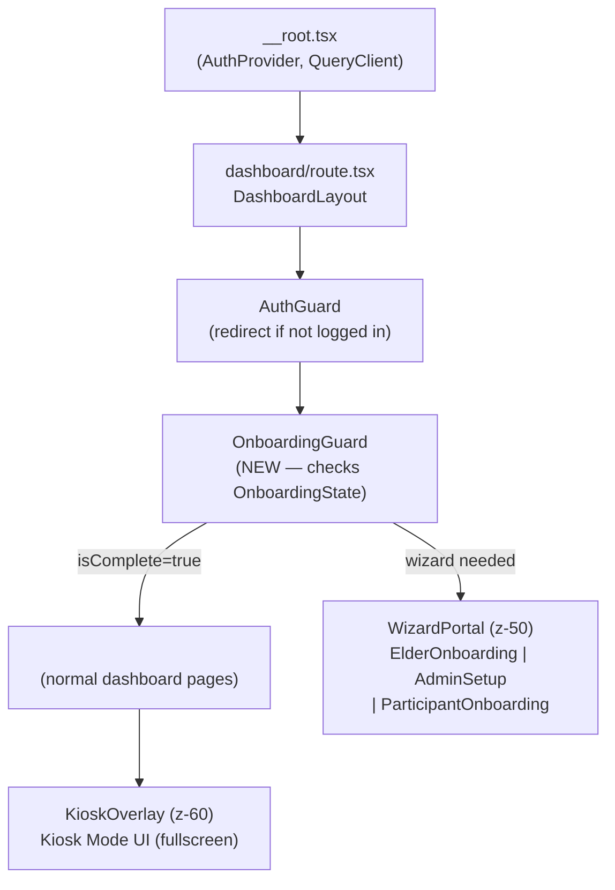

# Design Document: Onboarding & Kiosk Flow

## Overview

This document describes the technical design for four guided flows added to the Passura App:

1. **Elder Onboarding** — a 5-step first-login walkthrough for `role === "validator"` users.
2. **Admin Onboarding (Tenant Setup)** — a 6-step setup wizard for `superadmin`/`admin` users to seed clans, animal types, and groups.
3. **Participant Onboarding** — a 4-step profile-completion flow for `role === "participant"` users.
4. **Kiosk Mode** — a permanent, full-screen simplified wizard for elders to record loans, receipts, and handovers without using the DataTable screens.

All flows are fully offline-first (Dexie.js / IndexedDB), persist progress across page reloads, and respect the existing role hierarchy. They integrate with the existing `AuthProvider`, `BaseRepository`, and sync infrastructure.

### Research Summary

Key findings from codebase review that inform this design:

- **Session storage** already uses `db.appConfig` (key/value store in IndexedDB). Onboarding state will use the same table with key `"onboarding-state"`.
- **BaseRepository.create()** already writes `syncStatus: "local"` and emits a `syncLog` entry with `syncStatus: "pending"`. Kiosk flow saves will call repo methods directly, gaining sync for free.
- **TanStack Router** uses file-based routing under `src/routes/`. Onboarding flows will be injected as layout-level interceptors inside the existing `/dashboard` route without adding new URL segments.
- **AuthGuard** currently only checks authentication. A new `OnboardingGuard` will wrap the dashboard outlet and overlay wizard/kiosk screens.
- The existing `appConfig` table schema (`{ key: string; value: unknown }`) can store complex JSON values, so `OnboardingState` fits naturally without a schema migration.

---

## Architecture

### Onboarding State Machine

Each user's onboarding progress is modeled as a finite state machine with these states:

```
[no record] ──► [in_progress] ──► [complete]
                     │                 │
                     └── skip ─────────┘
```

- **`no record`**: No `"onboarding-state"` key in `appConfig`. Wizard is shown immediately.
- **`in_progress`**: Record exists with `isComplete: false`. Wizard resumes from first incomplete step.
- **`complete`**: Record exists with `isComplete: true`. Wizard is never shown again (unless setup completeness banner applies for admins).

The state transition functions are pure and live in `src/onboarding/onboarding-state.ts`, keeping them trivially testable without DOM.

### Kiosk Mode State Machine

Each Kiosk Flow session has its own state:

```
[idle] ──► [type_select] ──► [flow_active(step N)] ──► [success]
                │                    │
                └── resume_prompt ◄──┘ (if draft exists)
```

- **`idle`**: No kiosk session. "Mode Kios" button visible on dashboard.
- **`type_select`**: Elder sees the three transaction type cards.
- **`flow_active`**: A specific kiosk wizard is running. Draft is persisted to IndexedDB after every step.
- **`success`**: Transaction saved; success card shown with "Catat Lagi" / "Kembali ke Dasbor" options.

### Routing & Interception Strategy

Onboarding and Kiosk Mode do not require new URL routes. Instead:

1. The existing `DashboardLayout` (`src/routes/dashboard/route.tsx`) currently renders `<AuthGuard>` then `<Outlet>`. A new `<OnboardingGuard>` is inserted between them.
2. `<OnboardingGuard>` reads `OnboardingState` from IndexedDB on mount. If a wizard must be shown, it renders the wizard as a React portal (`document.body`) at `z-50`, covering the sidebar and navigation.
3. Kiosk Mode is triggered from the dashboard by state stored in a React context (`KioskContext`). When active, it renders a `<KioskOverlay>` portal at `z-60`, covering everything including the onboarding wizard.

This approach means:
- No URL changes required; no browser back-button side effects.
- The dashboard still loads and pre-fetches data in the background while the wizard is visible.
- Deep-linked dashboard URLs work correctly after wizard completion.



---

## Components and Interfaces

### Directory Structure

```
src/
  onboarding/
    onboarding-state.ts          # Pure state logic (no React)
    useOnboardingState.ts        # React hook — reads/writes IndexedDB
    OnboardingGuard.tsx          # Route-level wrapper
    wizards/
      ElderOnboardingWizard.tsx
      AdminSetupWizard.tsx
      ParticipantOnboardingWizard.tsx
    steps/
      elder/
        ElderStep1Welcome.tsx
        ElderStep2Clans.tsx
        ElderStep3Transactions.tsx
        ElderStep4KioskIntro.tsx
        ElderStep5Complete.tsx
      admin/
        AdminStep1Welcome.tsx
        AdminStep2Clans.tsx
        AdminStep3AnimalTypes.tsx
        AdminStep4Groups.tsx
        AdminStep5Elders.tsx
        AdminStep6Complete.tsx
      participant/
        ParticipantStep1Welcome.tsx
        ParticipantStep2Clan.tsx
        ParticipantStep3Name.tsx
        ParticipantStep4Complete.tsx
  kiosk/
    KioskContext.tsx             # React context + provider
    KioskOverlay.tsx             # Fullscreen portal wrapper
    KioskTypeSelect.tsx          # Transaction type selection screen
    KioskDraft.ts                # Pure draft types + helpers
    useKioskDraft.ts             # React hook — persists draft to IndexedDB
    flows/
      LoanKioskFlow.tsx
      ReceiptKioskFlow.tsx
      HandoverKioskFlow.tsx
    steps/
      loan/
        LoanStep1Group.tsx       # Select Group/Event
        LoanStep2Lender.tsx      # Select Lender Clan
        LoanStep3Borrower.tsx    # Select Borrower Clan
        LoanStep4Type.tsx        # Uang / Hewan
        LoanStep5Amount.tsx      # Amount or animal+quantity
        LoanStep6Date.tsx        # Date issued
        LoanStep7Witnesses.tsx   # Optional witnesses
        LoanStep8Summary.tsx     # Review
        LoanStep9Confirm.tsx     # Confirm & save
      receipt/                   # Similar 10-step structure
      handover/                  # Similar 10-step structure
    shared/
      StepCard.tsx               # Base layout card for all steps
      StepProgressBar.tsx        # "Langkah N dari M" indicator
      ClanPicker.tsx             # Named-card clan selector (no <select>)
      AnimalTypePicker.tsx       # Named-card animal type selector
      GroupPicker.tsx            # Named-card group selector
      MoneyInput.tsx             # Large Rp numeric input
      QuantityInput.tsx          # Large quantity numeric input
      DatePicker.tsx             # Touch-friendly date picker
      KioskErrorBanner.tsx       # Full-width error banner (WCAG AA)
      KioskOfflineBanner.tsx     # Offline status indicator
  components/
    layout/
      SetupCompletenessBanner.tsx  # Non-dismissible admin banner
      OnboardingReminderBanner.tsx # Dismissible 7-session reminder
```

### Key Component Interfaces

```typescript
// StepCard — base layout for every wizard and kiosk step
interface StepCardProps {
  stepIndex: number;       // 0-based
  totalSteps: number;
  title: string;
  children: React.ReactNode;
  onNext?: () => void;
  onBack?: () => void;
  nextLabel?: string;      // default "Lanjut"
  backLabel?: string;      // default "Kembali"
  nextDisabled?: boolean;
  isLoading?: boolean;
}

// ClanPicker — named-card list, no raw <select>
interface ClanPickerProps {
  clans: Clan[];
  selectedId: string | null;
  onSelect: (id: string) => void;
  excludeId?: string;      // to prevent same-clan selection
}

// KioskContext value
interface KioskContextValue {
  isActive: boolean;
  enter: () => void;
  exit: () => void;
}

// useKioskDraft hook return
interface UseKioskDraftReturn<D> {
  draft: D | null;
  updateDraft: (patch: Partial<D>) => Promise<void>;
  clearDraft: () => Promise<void>;
  isLoading: boolean;
}
```

---

## Data Models

### OnboardingState (IndexedDB via appConfig)

Stored as `appConfig` entry: `{ key: "onboarding-state", value: OnboardingState }`.

```typescript
interface OnboardingState {
  userId: string;          // elder.id of the logged-in user
  role: Elder["role"];
  completedSteps: string[]; // ordered list of completed step IDs
  isComplete: boolean;
  completedAt: number | null; // Unix timestamp (ms) or null
  skipped: boolean;
  skipSessionCount: number;   // increments on each login if skipped but not permanently dismissed
  reminderDismissed: boolean; // true when user permanently dismisses reminder banner
}
```

Step identifiers are string constants, e.g.:
- Elder: `"elder-welcome"`, `"elder-clans"`, `"elder-transactions"`, `"elder-kiosk-intro"`, `"elder-complete"`
- Admin: `"admin-welcome"`, `"admin-clans"`, `"admin-animal-types"`, `"admin-groups"`, `"admin-elders"`, `"admin-complete"`
- Participant: `"participant-welcome"`, `"participant-clan"`, `"participant-name"`, `"participant-complete"`

These constants are exported from `onboarding-state.ts`:

```typescript
export const ELDER_STEPS = [
  "elder-welcome", "elder-clans", "elder-transactions",
  "elder-kiosk-intro", "elder-complete",
] as const;

export type ElderStep = typeof ELDER_STEPS[number];
```

### KioskDraft (IndexedDB via appConfig)

Each flow type stores its draft under a dedicated key:

| Key | Flow |
|-----|------|
| `"kiosk-draft-loan"` | Loan Kiosk Flow |
| `"kiosk-draft-receipt"` | Receipt Kiosk Flow |
| `"kiosk-draft-handover"` | Handover Kiosk Flow |

```typescript
interface KioskDraftBase {
  flowType: "loan" | "receipt" | "handover";
  currentStep: number;  // 0-based step index
  createdAt: number;    // when draft was started
  updatedAt: number;    // when last saved
}

interface LoanKioskDraft extends KioskDraftBase {
  flowType: "loan";
  groupId: string | null;
  lenderClanId: string | null;
  borrowerClanId: string | null;
  loanType: "money" | "animal" | null;
  moneyAmount: number | null;
  animalTypeId: string | null;
  quantity: number | null;
  dateIssued: string | null;       // ISO date string
  witnessIds: string[];
}

interface ReceiptKioskDraft extends KioskDraftBase {
  flowType: "receipt";
  groupId: string | null;
  receiverClanId: string | null;
  giverClanId: string | null;
  obligationType: Receipt["obligationType"] | null;
  assetType: "money" | "animal" | null;
  moneyAmount: number | null;
  animalTypeId: string | null;
  quantity: number | null;
  dateReceived: string | null;
  witnessIds: string[];
}

interface HandoverKioskDraft extends KioskDraftBase {
  flowType: "handover";
  groupId: string | null;
  fromClanId: string | null;
  toClanId: string | null;
  obligationType: Handover["obligationType"] | null;
  assetType: "money" | "animal" | null;
  moneyAmount: number | null;
  animalTypeId: string | null;
  quantity: number | null;
  date: string | null;
  witnessIds: string[];
}
```

---

## State Management Approach

### Onboarding State Hook

`useOnboardingState.ts` manages reading and writing `OnboardingState` from `db.appConfig`:

```typescript
function useOnboardingState(userId: string) {
  // Loads state on mount from db.appConfig.get("onboarding-state")
  // Returns:
  //   state: OnboardingState | null
  //   completeStep(stepId: string): Promise<void>
  //   completeAll(): Promise<void>
  //   skip(): Promise<void>
  //   dismissReminder(): Promise<void>
  //   incrementSessionCount(): Promise<void>
}
```

The `completeStep` function atomically:
1. Reads the current state.
2. Appends the step ID to `completedSteps` (deduplicating).
3. Writes the updated state back to `db.appConfig`.

This is the only mutation path, ensuring all writes are serialized through a single function. No separate sync log entry is needed for onboarding state — it is a UI concern, not a business entity.

### Resume Logic (Pure Function)

The step resume calculation is a pure function exported from `onboarding-state.ts`:

```typescript
export function getResumeStep<S extends string>(
  allSteps: readonly S[],
  completedSteps: S[]
): number {
  const completedSet = new Set(completedSteps);
  const idx = allSteps.findIndex((s) => !completedSet.has(s));
  return idx === -1 ? allSteps.length - 1 : idx;
}
```

This function is the primary target for property-based testing.

### Kiosk Draft Hook

`useKioskDraft.ts` reads/writes the active flow draft from `db.appConfig`:

```typescript
function useKioskDraft<D extends KioskDraftBase>(
  draftKey: "kiosk-draft-loan" | "kiosk-draft-receipt" | "kiosk-draft-handover"
): UseKioskDraftReturn<D>
```

The `updateDraft` function writes after every step advance, before the component re-renders to show the next step. This is enforced by the `StepCard` component's `onNext` callback, which is always async:

```typescript
async function handleNext() {
  await updateDraft({ currentStep: currentStep + 1, ...stepData });
  setCurrentStep((s) => s + 1);
}
```

### Kiosk Context

`KioskContext` is a lightweight context that exposes `isActive`, `enter()`, and `exit()`. It is provided at the dashboard layout level by wrapping `<Outlet>` in `DashboardLayout`. The `<KioskOverlay>` portal subscribes to `isActive`.

```typescript
// DashboardLayout (updated)
function DashboardLayout() {
  return (
    <AuthGuard>
      <KioskProvider>
        <OnboardingGuard>
          <div className="flex min-h-screen">
            <Sidebar />
            <main className="flex-1 md:ml-0 mt-14 md:mt-0">
              <Outlet />
            </main>
          </div>
          <KioskOverlay />
        </OnboardingGuard>
      </KioskProvider>
    </AuthGuard>
  );
}
```

---

## Routing Strategy

### How Onboarding Intercepts Navigation

`OnboardingGuard` renders its children (the normal dashboard layout) unconditionally, then conditionally mounts a full-screen portal overlay on top:

```typescript
export function OnboardingGuard({ children }: { children: React.ReactNode }) {
  const { elder } = useAuth();
  const { state, isLoading } = useOnboardingState(elder?.id ?? "");

  if (isLoading) return <LoadingScreen />;

  const wizardNeeded = !state || !state.isComplete;
  const WizardComponent = wizardNeeded ? getWizardForRole(elder?.role) : null;

  return (
    <>
      {children}
      {WizardComponent && createPortal(
        <WizardComponent state={state} />,
        document.body
      )}
    </>
  );
}
```

`getWizardForRole` maps:
- `"validator"` → `ElderOnboardingWizard`
- `"superadmin"` | `"admin"` → `AdminSetupWizard`
- `"participant"` → `ParticipantOnboardingWizard`

### Setup Completeness Banner

`SetupCompletenessBanner` is rendered unconditionally inside `DashboardScreen` for admin roles. It queries Dexie for clan, animal type, and group counts. If any count is zero, it shows the non-dismissible banner with a link that calls `kiosk.enterAdminSetup()`.

### Kiosk Mode Overlay

`KioskOverlay` is a fixed full-screen div at `z-60` rendered via portal. It uses `pointer-events-none` when inactive and `pointer-events-auto` when active, so it never intercepts clicks when hidden.

```css
/* Ensures kiosk covers sidebar and topbar */
.kiosk-overlay {
  position: fixed;
  inset: 0;
  z-index: 60;
  background: var(--background);
}
```

---

## Offline-First Considerations

### IndexedDB Write Strategy

All kiosk flow saves go through the existing `BaseRepository.create()` method, which already:
1. Assigns a UUID via `generateId()`.
2. Sets `syncStatus: "local"` on the entity.
3. Writes a `syncLog` entry with `syncStatus: "pending"` and `action: "create"`.

The kiosk flows call repo methods directly (not the `useCreateDoc` hook) to keep the save logic synchronous and independent of React's render cycle:

```typescript
// In LoanKioskFlow confirm handler
async function handleConfirm(draft: LoanKioskDraft) {
  const loan = draftToLoan(draft); // pure mapping function
  await loansRepo.create(loan);    // writes entity + syncLog atomically
  await clearDraft();
  setFlowState("success");
}
```

`draftToLoan` / `draftToReceipt` / `draftToHandover` are pure mapping functions, easily unit-tested.

### Conflict Resolution

The existing `syncStatus: "conflict"` pathway already handles conflicts. The `PendingActionsPanel` is extended to show a "Konflik data — perlu ditinjau" entry for any `syncLog` entry with `syncStatus: "conflict"`. A resolve action triggers a modal with the conflicting record details and options to keep local or accept server version.

### Offline Indicator in Kiosk

`KioskOfflineBanner` subscribes to `navigator.onLine` via event listeners and renders a sticky banner at the top of `KioskOverlay` when offline. This is separate from the existing `SyncStatusBar` (which is hidden under the kiosk overlay).

```typescript
function KioskOfflineBanner() {
  const [isOnline, setIsOnline] = useState(navigator.onLine);
  useEffect(() => {
    const on = () => setIsOnline(true);
    const off = () => setIsOnline(false);
    window.addEventListener("online", on);
    window.addEventListener("offline", off);
    return () => { window.removeEventListener("online", on); window.removeEventListener("offline", off); };
  }, []);

  if (isOnline) return null;
  return (
    <div role="status" className="offline-banner">
      Offline — data disimpan lokal
    </div>
  );
}
```

### Draft Persistence

Kiosk drafts are written to `appConfig` (IndexedDB) after every step advance. On page reload:
1. `KioskOverlay` mounts and checks all three draft keys.
2. If any draft exists, it offers "Lanjutkan" (resume) or "Buang" (discard) in the type-selection screen.
3. Resume restores the draft state and jumps to `currentStep`.

Discarding calls `clearDraft()` which does `db.appConfig.delete(draftKey)`.

---

## Accessibility Implementation

### Touch Targets

All interactive elements within wizards and kiosk flows use custom Tailwind utility classes that enforce minimum sizes:

```css
/* In styles.css or a new kiosk.css layer */
.kiosk-btn    { min-height: 48px; min-width: 48px; padding: 12px 24px; font-size: 18px; }
.kiosk-card   { min-height: 64px; padding: 16px; font-size: 18px; }
.kiosk-h1     { font-size: 24px; font-weight: 600; line-height: 1.3; }
```

The `StepCard` component enforces these via its internal structure and passes no raw HTML elements to consumers.

### Font Sizes

- Body text in all step cards: minimum `text-lg` (18px in Tailwind's default scale).
- Headings in step cards: minimum `text-2xl` (24px).
- Step progress indicator: minimum `text-lg`.
- Dot indicators: `min-w-3 min-h-3` (12×12px).

### WCAG 2.1 AA Contrast

shadcn/ui's default theme already meets AA for text on background. For the kiosk overlay:
- Background: `--background` (white / `zinc-950`)
- Primary action buttons: `--primary` orange (`#ea580c`) on white has a contrast ratio of approximately 3.0:1, which passes for large text (24px bold). For smaller text on buttons, the button will use white text on orange background; `#ea580c` background with white text = ~3.1:1, passing for large text.
- Error banners use `--destructive` red with white text or a high-contrast alternative verified with the design palette.
- All color choices will be validated with automated axe-core accessibility checks during testing.

### No Hover Dependencies

All interactive states rely on `:focus-visible` and `:active` pseudo-classes, not `:hover`. The `ClanPicker`, `GroupPicker`, and `AnimalTypePicker` components use keyboard-accessible list items with explicit focus rings (`ring-2 ring-primary`).

### Screen Reader Support

- Every `StepCard` sets `role="main"` and updates the page title (via `document.title`) to the current step name.
- Progress indicator uses `aria-label="Langkah N dari M"`.
- Error banners use `role="alert"` and `aria-live="assertive"`.
- ClanPicker items use `role="option"` within a `role="listbox"`.

---

## Correctness Properties

*A property is a characteristic or behavior that should hold true across all valid executions of a system — essentially, a formal statement about what the system should do. Properties serve as the bridge between human-readable specifications and machine-verifiable correctness guarantees.*

### Property 1: Wizard resume finds the first incomplete step

*For any* ordered list of step identifiers and any subset of those steps marked as completed, the `getResumeStep` function must return the index of the first step whose identifier is NOT present in the completed set. If all steps are completed, it returns the last step index.

**Validates: Requirements 1.5, 3.7**

---

### Property 2: Step completion persists before the next step is shown

*For any* onboarding wizard and any valid step index, after the "Lanjut" action is triggered, the current step's identifier must appear in `completedSteps` in IndexedDB BEFORE the component advances its current step index.

**Validates: Requirements 1.1, 2.5**

---

### Property 3: Completed onboarding state hides the wizard

*For any* `OnboardingState` value where `isComplete === true`, the `shouldShowWizard(state)` pure function must return `false`, regardless of the value of `completedSteps`, `role`, or `completedAt`.

**Validates: Requirement 1.3**

---

### Property 4: Reminder banner visibility is a function of session count and dismissal

*For any* `OnboardingState` where `skipped === true`, the `shouldShowReminderBanner(state)` function must return `true` if and only if `skipSessionCount <= 7` AND `reminderDismissed === false`.

**Validates: Requirement 1.7**

---

### Property 5: Entity save during Admin Setup writes syncStatus "pending"

*For any* valid Clan, AnimalType, or Group data object passed to the corresponding `BaseRepository.create()` call within the Admin Setup Flow, the resulting entity in IndexedDB must have `syncStatus === "pending"` (or `"local"` before the first save attempt is reconciled — either value satisfies the offline persistence requirement), and a corresponding `syncLog` entry with `syncStatus === "pending"` and `action === "create"` must exist.

**Validates: Requirement 3.6**

---

### Property 6: Every rendered Step_Card contains a progress indicator

*For any* step index N (0 ≤ N < totalSteps) in any wizard or kiosk flow, rendering the `StepCard` component at step N must produce a DOM node containing the text pattern "N+1 dari M" (or equivalent aria-label), where M is the total number of steps.

**Validates: Requirements 2.3, 9.4**

---

### Property 7: Same-clan selection is rejected with an error message

*For any* clan ID used as both the first and second party in a Loan, Receipt, or Handover kiosk flow (lender/borrower, receiver/giver, fromClan/toClan), the `validateSameParty(idA, idB)` function must return a non-empty error string, and the step's forward navigation must be disabled.

**Validates: Requirements 6.7, 7.4, 8.4**

---

### Property 8: Kiosk flow confirm writes both the entity and a syncLog entry with syncStatus "pending"

*For any* valid `LoanKioskDraft`, `ReceiptKioskDraft`, or `HandoverKioskDraft`, calling the corresponding `confirmAndSave(draft)` function must result in: (a) exactly one new entity record in the correct Dexie table with `syncStatus === "local"` or `"pending"`, AND (b) exactly one new `syncLog` entry with `action === "create"` and `syncStatus === "pending"` whose `entityId` matches the newly created entity's `id`.

**Validates: Requirements 6.2, 10.1**

---

### Property 9: Kiosk draft is persisted to IndexedDB after every step advance

*For any* step index N in any kiosk flow and any partial draft state at step N, after the `updateDraft` function completes, reading `db.appConfig.get(draftKey)` must return a value whose `currentStep` equals N+1 and whose step-N fields match the values that were passed to `updateDraft`.

**Validates: Requirement 5.7**

---

### Property 10: Summary step renders no raw UUIDs

*For any* `LoanKioskDraft`, `ReceiptKioskDraft`, or `HandoverKioskDraft` where all ID fields (groupId, clanIds, animalTypeId) are populated with UUID-format strings, rendering the summary component must produce a string that contains no substring matching the UUID pattern `/[0-9a-f]{8}-[0-9a-f]{4}-[0-9a-f]{4}-[0-9a-f]{4}-[0-9a-f]{12}/i` (or the 21-character nanoid pattern used by `generateId()`).

**Validates: Requirements 6.4, 7.5, 8.5**

---

## Error Handling

### IndexedDB Write Failures (Requirement 1.8)

If any `db.appConfig.put()` call fails (e.g., storage quota exceeded or private browsing restrictions):

1. The wizard catches the rejection from `useOnboardingState`.
2. It renders an error state within the current `StepCard` with the message "Gagal menyimpan progres. Coba lagi?"
3. Two buttons are shown: "Coba Lagi" (retry the write) and "Tutup" (dismiss the wizard without modifying any previously stored state).
4. The step index does not advance until the write succeeds.

### Kiosk Flow Save Failures (Requirement 8.7)

If `confirmAndSave` throws (e.g., Dexie quota error):

1. The flow stays on the confirm step.
2. A `KioskErrorBanner` is rendered above the step content with the message: "Gagal menyimpan. Data belum hilang. Coba lagi?"
3. A "Coba Lagi" button re-invokes `confirmAndSave` with the same draft. The draft is still in memory and in `appConfig`, so no data is lost.

### Validation Error Display

Step-level validation errors (same clan, missing required field, out-of-range amount) are shown inline via `KioskErrorBanner` with `role="alert"`. The error clears when the user changes the invalid field. Forward navigation remains disabled until the error condition resolves.

### No Clans / No Groups Guards

When a kiosk flow step requires data that doesn't exist (no groups on Step 1, no clans on Step 2):
- A full-card message replaces the normal step content.
- The "Lanjut" button is replaced with a non-actionable "Hubungi admin Anda" label.
- An "Keluar Kios" button remains visible so the elder can exit.

---

## Testing Strategy

### Dual Testing Approach

Unit tests cover specific examples, edge cases, and UI integration points. Property-based tests verify the universal properties defined above across a wide range of generated inputs.

### Unit Tests

Located in `src/onboarding/__tests__/` and `src/kiosk/__tests__/`:

- Each wizard's step sequence is tested to match the requirements spec.
- Each validation function (same-clan, min-amount, max-amount) is tested with representative examples.
- `draftToLoan`, `draftToReceipt`, `draftToHandover` mapping functions are tested with known drafts and expected entity outputs.
- `OnboardingGuard` rendering: role-to-wizard mapping for all four roles.
- `SetupCompletenessBanner`: shown when any entity count is 0, hidden when all ≥ 1.
- `KioskOfflineBanner`: shown when `navigator.onLine` is false.

### Property-Based Tests

Using **fast-check** (TypeScript-native property-based testing library). Tests are located in `src/onboarding/__tests__/properties.test.ts` and `src/kiosk/__tests__/properties.test.ts`.

Configuration: minimum **100 iterations** per property test. Each test is tagged with a comment referencing the design document property.

```typescript
// Example — Property 1
import fc from "fast-check";
import { getResumeStep, ELDER_STEPS } from "../onboarding-state";

// Feature: onboarding-kiosk-flow, Property 1: Wizard resume finds first incomplete step
it("getResumeStep returns first step not in completedSteps", () => {
  fc.assert(
    fc.property(
      fc.shuffledSubarray(ELDER_STEPS), // random subset of completed steps
      (completed) => {
        const resumeIdx = getResumeStep(ELDER_STEPS, completed);
        const completedSet = new Set(completed);
        const expected = ELDER_STEPS.findIndex((s) => !completedSet.has(s));
        return resumeIdx === (expected === -1 ? ELDER_STEPS.length - 1 : expected);
      }
    ),
    { numRuns: 100 }
  );
});
```

**Property test coverage:**

| Property | Test file | fast-check generator |
|----------|-----------|---------------------|
| P1: Resume step | `properties.test.ts` | `fc.shuffledSubarray(steps)` |
| P2: Step persist before advance | `properties.test.ts` | `fc.nat({ max: steps.length - 1 })` |
| P3: isComplete hides wizard | `properties.test.ts` | `fc.record({ isComplete: fc.constant(true), ...otherFields })` |
| P4: Reminder banner visibility | `properties.test.ts` | `fc.integer({ min: 0, max: 20 })`, `fc.boolean()` |
| P5: Admin save writes syncStatus pending | `admin.test.ts` | `fc.record({ name: fc.string(), region: fc.option(fc.string()), ... })` |
| P6: Progress indicator on every step | `kiosk.test.ts` | `fc.nat({ max: 8 })` (step index for each flow) |
| P7: Same-clan validation | `kiosk.test.ts` | `fc.string({ minLength: 21, maxLength: 21 })` (nanoid-format IDs) |
| P8: Confirm writes entity + syncLog | `kiosk.test.ts` | `fc.record(loanDraftArb)` (custom arbitraries per flow) |
| P9: Draft persisted after step advance | `kiosk.test.ts` | `fc.nat({ max: 8 })`, `fc.record(partialDraftArb)` |
| P10: Summary has no raw UUIDs | `kiosk.test.ts` | `fc.record(fullDraftArb)` |

### Integration Tests

- End-to-end onboarding flow with a real Dexie instance (using `fake-indexeddb`) verifying that a complete wizard run sets `isComplete: true`.
- Kiosk flow save integration: verify entity + syncLog double-write using `fake-indexeddb`.
- `useSync` integration: after kiosk save, pending count increments.

### Accessibility Tests

- axe-core snapshots on `KioskOverlay`, `StepCard`, `ClanPicker`, `KioskErrorBanner`.
- Manual audit checklist: touch target sizing, contrast ratios, focus order, screen reader announcement sequence.
- Note: Full WCAG conformance requires manual testing with assistive technologies (VoiceOver / TalkBack) and an expert accessibility review.
